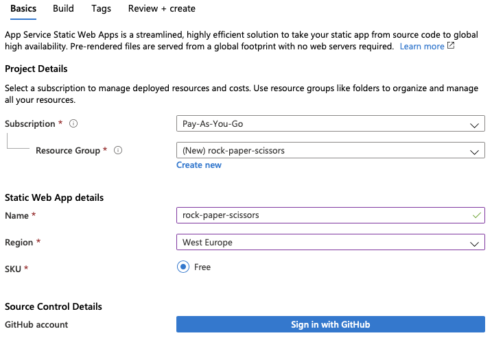
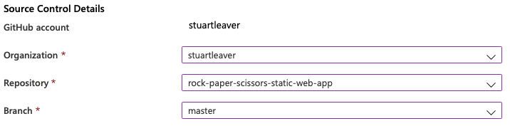
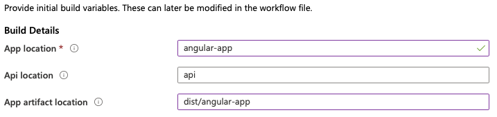
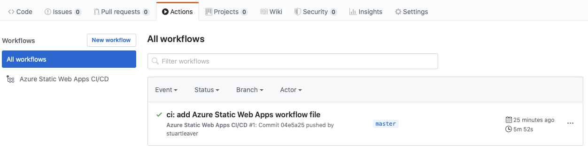
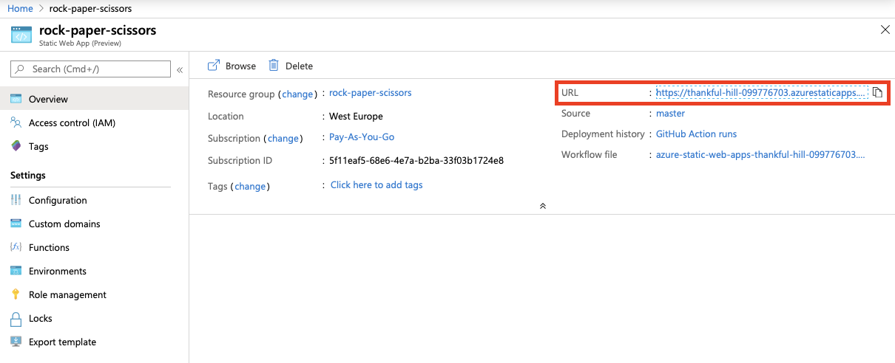
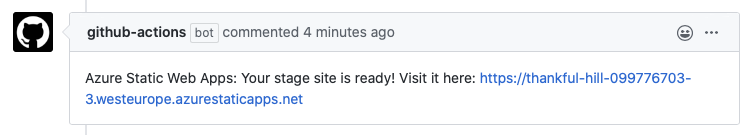

# A Rock Paper Scissors game hosted within an Azure Static Web App

At Build 2020, Microsoft announced [Static Web Apps](https://azure.microsoft.com/en-gb/services/app-service/static/). Static Web App's allows acceleration of development with a static front fend with the option of using serverless API's as the back end. The serverless API's being Azure Functions.

Azure Static Web Apps also automatically builds and deploys full stack web apps to Azure from a GitHub repository.

# The Game
Rock paper scissors is a hand game usually played between two people, in which each player simultaneously forms one of three shapes with an outstretched hand. A player who decides to play rock will beat another player who has chosen scissors, but will lose to one who has played paper; a play of paper will lose to a play of scissors. If both players choose the same shape, the game is tied.

# Deployment

*Note - If forking this repository, please make sure you have the Azure Static Web App API in your repo's secrets..*

Azure Static Web Apps deploys a full stack web app directly from a GitHub repository.

The following steps (specific to the code in the repo used) is how this can be achieved through the Azure Portal.

1. Start by creating a new Static Web Apps in the Azure Portal by searching for Static Web Apps.

2. Start by configuring the new app and linking a GitHub repository:

3. Once you have signed into GitHub, enter the repository information:

4. Click the Next: Build

5. Add the configuration details specific to your app. The screenshot shows the configuration specific to this app:

6. Click the Review + create button.

7. If the details are correct, click the Create button.

8. The Static Web App will now be created and will add an Action to the GitHub repository:

Once the resource has been created, the overview window will show a series of links that will help interact with the web app. In the case of Rock paper scissors, the Azure Function will also show in the `Functions` blade.

The URL for the Web App will be one of those links.

# Staging Sites
The Action that is created by Azure Static Web Apps will also trigger when a pull request is created against a branch that the workflow watches. When the Action is triggered for a pull request, a staging environment will be created. This staging environment is a fully-functional staged version of your application that includes changes not available in production.

# Custom Domain
If you wish, you can also add a [custom domain](https://docs.microsoft.com/en-gb/azure/static-web-apps/custom-domain).

# The Result
Why not go a check it out yourself at [https://www.rockpaperscissors.cloud](https://www.rockpaperscissors.cloud)
